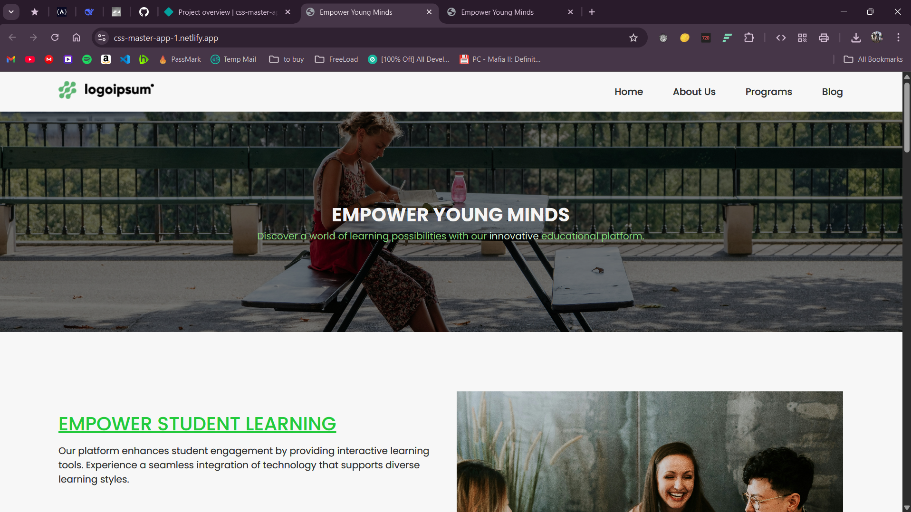

# css-master - Educational Platform Website

[](https://your-live-demo.com)

A responsive educational platform website built independently after completing [The Only CSS Course You Need](https://youtu.be/0hrJGWrCux0) by edroh.

## ✨ Features
- Fully responsive layout (In Development)
- Interactive hover states
- Modern form validation
- Card-based program sections
- Social media integration
- Semantic HTML structure

## 🛠 Built With
- HTML5
- CSS3 (Flexbox)
- Google Fonts (Poppins)
- Font Awesome Icons
- Mobile-first workflow (In Development)

## 🧠 Key Implementation
```css
/* Custom list styling */
.list-item::before {
  content: "→";
  color: #34c759;
}

/* Complex hover transitions */
.card-btn:hover {
  background: transparent;
  border-color: #5bb471;
  transition: 0.2s ease-in-out;
}

/* Overlay effects */
.video-container {
  background-blend-mode: overlay;
  background: rgba(0,0,0,0.33) url(./images/video.jpg);
}
```

## 🚀 Development Notes
1. Implemented without tutorial guidance
2. Added similar color scheme

## 📚 Resources Used
- [CSS Flexbox Guide](https://css-tricks.com/snippets/css/a-guide-to-flexbox/)
- [Font Awesome Docs](https://fontawesome.com/docs)
- [Google Fonts Pairing](https://fonts.google.com/knowledge)

## 🙏 Acknowledgments
Credit to [edroh](https://youtube.com/@EdRohDev) for foundational CSS concepts

▶️ [Tutorial Reference](https://youtu.be/0hrJGWrCux0) | 🚀 [Live Demo](https://css-master-app-1.netlify.app/)

<sub>Redeveloped by Krowey Richmond Borquaye</sub>